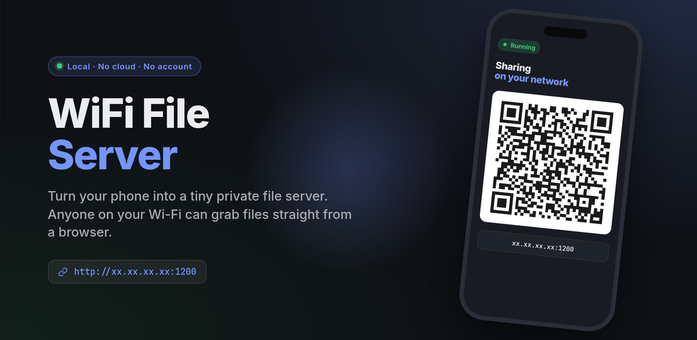

# WiFi File Server (Android)

<p align="center">
  <a href="https://ibrahimrafi.me/apps/wifi-file-server/">
    
  </a>
</p>

<p align="center">
  <a href="https://ibrahimrafi.me/apps/wifi-file-server/">Website</a> ·
  <a href="https://ibrahimrafi.me/apps/wifi-file-server/privacy.html">Privacy</a> ·
  <a href="https://github.com/rafiibrahim8/android-wifi-fileserver/releases/latest">Latest release</a>
</p>

Android app to share files from your phone over local Wi-Fi using a browser.

It runs an HTTP server on your device, shows a URL + QR code, and provides a simple web UI for browsing/downloading files.

## Features

- Local file server over Wi-Fi (`NanoHTTPD`)
- Web UI for:
  - Directory browsing with breadcrumb navigation
  - File download (range / resume supported)
  - Copy direct link per file
  - File upload (toggleable)
  - Folder creation (enabled unless **Read Only Fileserver** is on)
  - ZIP download for directories (toggleable)
- Read-only server mode (download-only)
- Optional basic authentication (user/password)
- Transfer tracking in-app, persisted across app restarts (Home + Transfers tabs)
- Foreground service notification while server is running
- Abandoned partial uploads (`.part` files) are swept after 24 h on next start
- Optional per-server max throughput cap

## Requirements

- Android Studio (latest stable recommended)
- Android SDK 36 (compileSdk / targetSdk)
- JDK 17
- Android device/emulator with API 24+

## Build

```bash
./gradlew :app:assembleDebug
./gradlew :app:assembleRelease
```

## Run

1. Open the project in Android Studio.
2. Install and launch the app.
3. Go to **Settings** and choose a **Root folder**.
4. (Optional) Configure:
   - Anonymous access / auth
   - Allow uploads
   - Read Only Fileserver
   - Allow ZIP download
5. Go to **Home** and tap **START SERVER**.
6. Open the shown URL (or scan QR) from another device on the same Wi-Fi network.

## Important Notes

- Both devices must be on the same network.
- Server URL is HTTP (cleartext). The app is intended for trusted local networks.
  Credentials and access tokens are stored in plain `SharedPreferences` — fine for
  personal use, not for shared devices.
- In **Read Only Fileserver** mode:
  - Upload is disabled
  - Folder creation is disabled
  - Web UI hides related controls
- The foreground service uses `foregroundServiceType="dataSync"`. On Android 15+
  (API 35) the OS caps `dataSync` runtime at 6 hours per 24-hour period.

## Tech Stack

- Kotlin
- AndroidX (AppCompat, Fragment, Preference, Lifecycle ViewModel/LiveData)
- `org.nanohttpd:nanohttpd`
- `androidx.documentfile`
- ZXing (`com.google.zxing:core`) for QR generation
- Timber for debug-only structured logging

## Tests

Unit tests for HTTP utilities live in `app/src/test/`. Run with:

```bash
./gradlew :app:testDebugUnitTest
```
